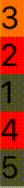

# AnimatableStackView

[](https://github.com/Carthage/Carthage)
[](http://cocoapods.org/pods/AnimatableStackView)
[](http://cocoapods.org/pods/AnimatableStackView)
[](http://cocoapods.org/pods/AnimatableStackView)
[](https://travis-ci.org/APUtils/AnimatableStackView)

AnimatableView that works like a UIStackView but has better animations

## Example

Clone the repo and then open `Carthage Project/AnimatableStackView.xcodeproj`

## GIF animation



## Installation

#### CocoaPods

AnimatableStackView is available through [CocoaPods](http://cocoapods.org). To install
it, simply add the following line to your Podfile:

```ruby
pod 'AnimatableView', '~> 6.0'
```

## Usage

Just call `.update(viewModels:)` method with new view models and then perform layout inside animation block:
```swift
UIView.animate(withDuration: 2) {
    self.animatableView.update(viewModels: self.vms1)
    self.view.layoutIfNeeded()
}
```

See example and test projects for more details.

## Contributions

Any contribution is more than welcome! You can contribute through pull requests and issues on GitHub.

## Author

Anton Plebanovich, anton.plebanovich@gmail.com

## License

AnimatableStackView is available under the MIT license. See the LICENSE file for more info.
